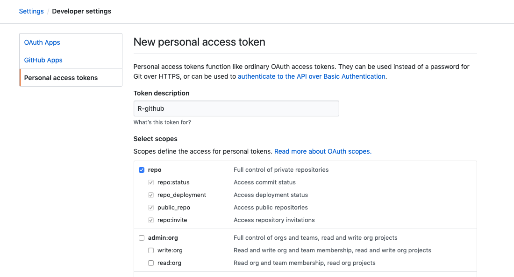

<!-- README.md is generated from README.Rmd. Please edit that file -->

# LCBC Questionnaires 

<!-- badges: start -->

[](https://circleci.com/gh/LCBC-UiO/Questionnaires)
[](https://www.tidyverse.org/lifecycle/#experimental)
<!-- badges: end -->

The repository contains functions to run coversions and calculate
components from commonly used questionnaires in LCBC research.

The questionnaires covered so far:

  - PSQI - Pittsburgh Sleep Quality Inventory
  - IPAQ - International Physical Activity Questionnaire
  - EHI - Edinburgh Handedness Inventory
  - BDI - Beck Depression Inventory
  - GDS - Geriatric Depression Scale
  - TAS -

All functions in this package are prefixed with the name of the
questionnaire the function is intended for (i.e. `psqi_`, `ipaq_` etc.).
Column specifications may be manually inputed, but if columns are named
after as the function expects (i.e. MOAS standard), the functions
generally work without manual input. The functions that will run all
(most) necessary steps to completely calculate components and sums are
named as `questionnaire_compute` (i.e. `psqi_compute()`, `ipaq_compute`,
etc.). These functions all have the option to `keep_all` which takes a
`TRUE` or `FALSE` statement on whether the data should be appended to
the input data, or just to return the computed columns.

Vignettes are on their way, and so far there are only vignettes for PSQI
and IPAQ which just describe the background for the computations.

## Installation

As this package is in a private github repository, you need to do a
couple of steps to install it.

First, install the packages `usethis` and `remotes`.

    install.packages(c("remotes", "usethis"))

Then, in github, create a Personal Access Token (PAT) by going to
Settings -\> Developer Settings -\> Personal Access Token -\> Generate
new access token.

Give the token a name, and tick of all boxes in the `repo` category.


Copy the token that is made, then go back to R. In R, type
`usethis::edit_r_environ()`, which should open a blank file (if you have
not edited it before) called `.Renviron`. Here add this line:
`GITHUB_PAT=yourtoken`, and add your token after the `=` sign. Restart R
(go to Session - Restart R in RStudio), and then you should be able to
install this package.

You can install the private version of Questionnaires from
[GitHub](https://github.com/) with:

``` r
# install.packages("remotes")
remotes::install_github("LCBC-UiO/Questionnaires")
```
